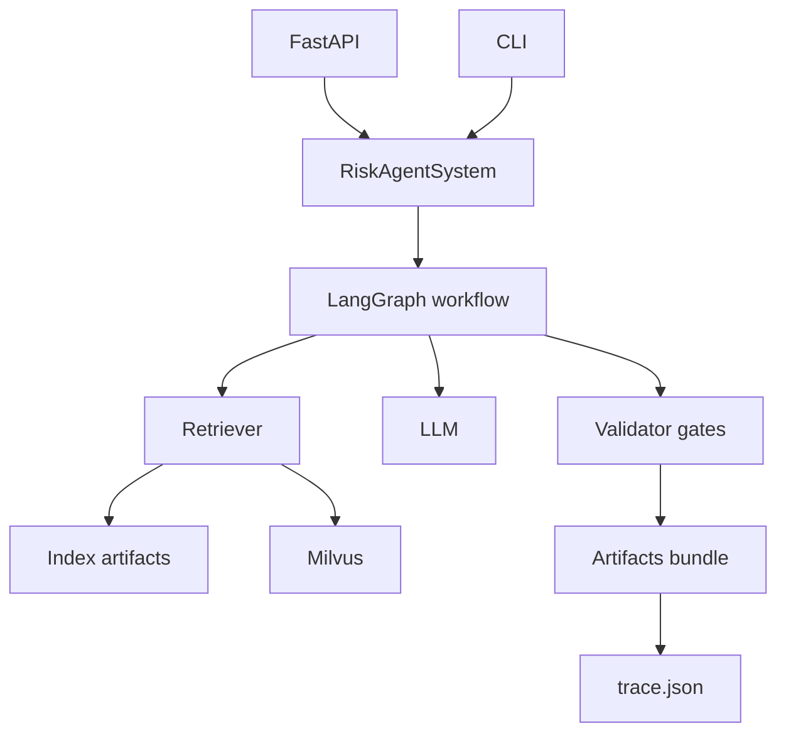
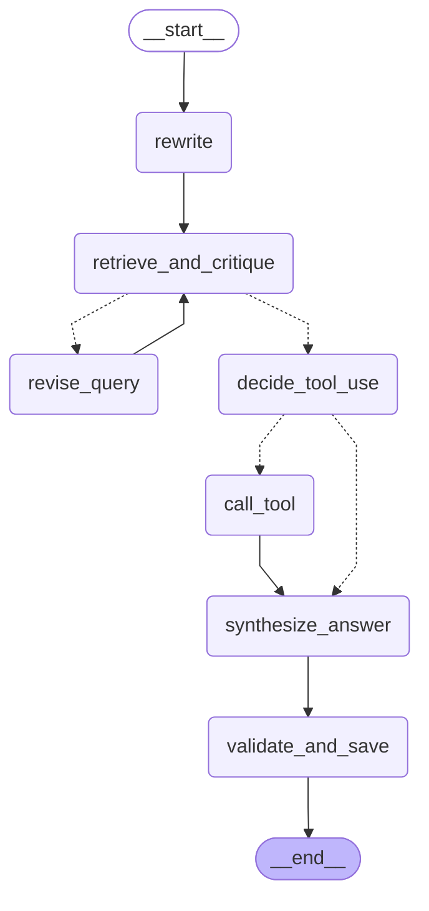

# ARCHITECTURE

## 高层目标

- 面向企业内部软件工程师
- 用 RAG 基于语料回答
- answer 必须带 citations 方便回溯到原文
- 编排层用 LangGraph
- LLM 统一走 OpenAI compatible (OpenRouter)

## 快速架构图



读图要点
1 API CLI 共享同一个业务门面 RiskAgentSystem
2 LangGraph 是唯一主流程
3 每次请求都会落盘 artifacts bundle 目录 里面有 trace request response

## 大模型接入

统一使用 OpenRouter 的 OpenAI compatible 接口

- 只需配置 `OPENAI_API_KEY` 或 `LLM_API_KEY`
- 可选配置 `OPENROUTER_SITE_URL` `OPENROUTER_APP_NAME`

未配置或无法连接 LLM 时会直接报错

## 核心模块

- `riskagent_rag.indexing`
  - 增量索引 构建 manifest 写入 Milvus 与各类语料 JSONL
- `riskagent_rag.rag`
  - ingest chunking
  - retrieve rerank reroute
- `riskagent_rag.llm`
  - LLM 接入封装
  - OpenAI compatible client
- `riskagent_rag.api`
  - HTTP API v1 healthz readyz metrics ask chat
- `riskagent_rag.agents`
  - retrieval agent
  - explanation agent
  - coordinator

## 数据流

sources -> chunk -> embeddings -> milvus
query -> retrieve -> contexts -> multi-agent -> answer + citations

## LangGraph Agentic Loop 可视化

这是 RiskAgent 项目中 agentic RAG loop 的执行流程图.

### 流程图



### 节点说明

- **查询改写 (rewrite)**: 将用户问题改写为更适合检索的 query
- **检索与评估 (retrieve_and_critique)**: 检索文档并评估质量
- **修订查询 (revise_query)**: 基于 critique 改进 query
- **决策工具调用 (decide_tool_use)**: LLM 决定是否需要调用工具
- **调用工具 (call_tool)**: 调用 DataAgent 获取结构化数据
- **合成答案 (synthesize_answer)**: 基于检索结果和工具输出生成最终答案
- **验证与落盘 (validate_and_save)**: 运行 validator gates 并保存 artifacts

### 详细流程图 (含 Week 8-11 高级特性)

此图展示了系统内部的详细逻辑，特别是 Retrieve & Critique 节点内部的混合检索、查询理解、高级索引和 Self-RAG 评分流程。

```mermaid
graph TD
    %% LangGraph Nodes
    Start((Start)) --> Rewrite[Node: Rewrite Query<br/>查询改写]
    Rewrite --> Retrieve[Node: Retrieve & Critique<br/>检索与评估]

    %% Internal Logic of Retrieve Node
    subgraph Retrieve_Internal [Retrieve & Critique 节点内部逻辑]
        direction TB
        QueryIntel[Query Intelligence<br/>(Week 9: 意图路由/变体生成)]
        Hybrid[Hybrid Retriever<br/>(Week 8: Dense + Sparse + Rerank)]
        AdvIndex[Advanced Indexing<br/>(Week 10: Parent/Summary/HyDE)]
        SelfRAG_Grade[Self-RAG Grading<br/>(Week 11: 质量打分)]
        
        QueryIntel --> Hybrid
        Hybrid --> AdvIndex
        AdvIndex --> SelfRAG_Grade
    end

    %% Flow Control
    Retrieve -- 质量不足/需要更多信息 --> Revise[Node: Revise Query<br/>查询修订]
    Revise --> Retrieve

    Retrieve -- 质量达标 --> ToolDecide[Node: Decide Tool Use<br/>工具决策]

    ToolDecide -- 需要工具 --> CallTool[Node: Call Tool<br/>调用风险数据工具]
    CallTool --> Synthesize
    ToolDecide -- 不需要 --> Synthesize[Node: Synthesize Answer<br/>答案合成]

    Synthesize --> Validate[Node: Validate & Save<br/>幻觉检查 & 落盘]
    Validate --> End((End))

    %% Styling
    style Retrieve fill:#e1f5fe,stroke:#01579b,stroke-width:2px
    style Retrieve_Internal fill:#ffffff,stroke:#0288d1,stroke-dasharray: 5 5
```

### 查看方式

1. 在 GitHub 上直接查看 (GitHub 原生支持 Mermaid)
2. 使用 Mermaid 在线编辑器: https://mermaid.live/
3. 在支持 Mermaid 的 Markdown 编辑器中查看 (如 Typora, VS Code with Mermaid extension)

## 质量保障与开发方法论 (Quality Assurance & Methodology)

### Evaluation Driven Development (EDD)

本项目采用 **EDD (评测驱动开发)** 模式，即在开发功能之前，先定义评测样本与通过标准。

- **原则**: 先定义 "Bad Case" (坏样本)，再优化系统直到 Pass。
- **流程**:
  1.  发现问题或定义新需求。
  2.  在评测集 (`tests/data/eval_set.json` 或专用负样本集) 中添加对应的测试用例。
  3.  运行评测脚本，确认失败 (Red Phase)。
  4.  修改 Agent 逻辑或 Prompt。
  5.  再次运行评测，确认通过且无回归 (Green Phase)。

### 拒答机制 (Refusal Mechanism)

为了保证金融场景的可信度，系统必须具备**拒答能力**。

- **架构要求**:
  - **负样本集 (Negative Dataset)**: 评测集中必须包含 20%+ 的负样本（如库外知识、恶意提问、无意义输入）。
  - **Refusal Gate**: 在 Agentic Loop 中必须包含显式的拒答门控（Refusal Gate）。
    - 当检索结果 (`docs`) 为空或相关性 (`context_relevance`) 低于阈值时，必须拒答。
    - 当生成的 `claims` 无法被 `evidence` 强支撑时，必须拒答或标记为不确定。
  - **验收标准**:
    - 正样本拒答率 (False Refusal Rate) < 5%
    - 负样本拒答率 (True Refusal Rate) > 95%
