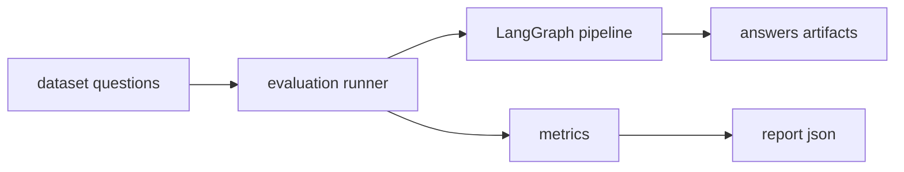

# EVALUATION

这份文档讲清楚怎么跑评测
目标是让你能回答三个问题
1 现在系统质量怎么样
2 这次改动有没有退化
3 哪条样本失败了 失败原因是什么

## 评测跑的是什么

评测会做两件事
- 跑系统得到 answers citations claims evidence_set decision_log tool_traces
- 计算指标并把报告写到 .artifacts/reports



## 前置条件

要跑评测你需要能生成答案
也就是 LLM 必须可用

必需环境变量
- OPENAI_API_KEY 或 LLM_API_KEY
- LLM_BASE_URL
- LLM_MODEL

可选环境变量
- EMBEDDINGS_PROVIDER 默认 hf
- EMBEDDINGS_MODEL 默认 sentence transformers all MiniLM L6 v2

注意
如果你只想离线跑少量启发式指标 也可以先用测试替代
例如 tests.test_week8_hybrid_rerank_acceptance

## 一条命令跑评测

最常用

```bash
conda run -n LangChain python -m riskagent_rag.evaluation.run --stage step4 --label step4
```

输出位置
- .artifacts/reports

## 常用参数

- --stage step1 step2 step3 step4
- --label 用来区分不同配置的报告
- --dataset 评测集路径 默认 tests/data/questions.json
- --artifacts-dir 默认 .artifacts
- --enable-citation-judge 开启引用精准度 judge
- --citation-judge-mode auto llm heuristic

judge 模式
- auto 优先 llm 不可用时退到 heuristic
- llm 强制 llm 不可用则失败
- heuristic 纯规则离线打分

## 如何新增评测样本

编辑 tests/data/questions.json

```json
[
  {
    "id": "q1",
    "question": "What is FRTB",
    "reference_answer": "...",
    "ground_truth_contexts": ["..."]
  }
]
```

## 如何看报告

报告是一个 json
核心部分
- metrics 汇总指标
- samples 每条样本的输入输出和单项结果
- baseline_diff 如果指定了 baseline 会输出差异

排障建议
- 先看 samples 里的 status failure_reason
- 再去 artifacts bundle 里看 trace.json
详细见 docs/TRACE
