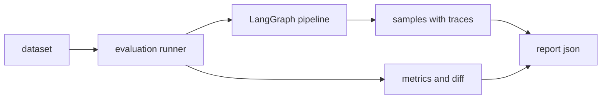

# Evaluation 模块

Evaluation 模块是 RiskAgent-AgenticRAG 的评测驱动开发（EDD）核心，提供全面的多维度评估体系。

## 模块职责

| 职责 | 说明 |
|------|------|
| 多维度指标计算 | 检索质量、引用精度、领域一致性、RAGAS 指标等 |
| 评估报告生成 | JSON/Markdown 格式，包含样本级和汇总级结果 |
| 阈值门禁策略 | 可配置的阈值，自动判定是否可发布 |
| 退化检测与基线比较 | 与历史报告对比，标记退化项 |
| 灵活的指标计算工具 | 支持指定模块和具体指标 |

## 主要文件

| 文件 | 说明 |
|------|------|
| `run.py` | 端到端评估入口 |
| `compute_metric.py` | 灵活的指标计算工具（新增） |
| `ragas_metrics.py` | RAGAS 指标（含新增指标） |
| `domain_consistency.py` | 领域一致性（数值、术语） |
| `citation_precision.py` | 引用精度与幻觉检测 |
| `advanced_metrics.py` | 检索、门禁、可靠性与成本指标 |
| `reporting.py` | 报告生成与退化检测 |
| `thresholds.py` | 阈值配置加载 |
| `dataset.py` | 测试数据集加载 |

---

## 指标体系

### 1. 指标模块划分

| 模块 | 包含指标 |
|------|---------|
| **domain_consistency** | numeric_consistency_score, glossary_consistency_score, domain_consistency_score |
| **citation_precision** | citations_coverage, citation_precision, hallucination_rate_in_citations |
| **ragas** | ragas_faithfulness, ragas_answer_relevancy, ragas_context_relevancy, ragas_response_completeness, ragas_context_precision_no_ref, ragas_contradiction_score |
| **advanced** | retrieval_metrics, gate_metrics, reliability_metrics |

### 2. RAGAS 指标

| 指标 | 含义 | 典型解释 |
|------|------|---------|
| ragas_faithfulness | 答案忠实度 | 答案是否基于上下文 |
| ragas_answer_relevancy | 答案相关性 | 答案是否切题 |
| ragas_context_relevancy | 上下文相关性 | 检索上下文与问题的相关度 |
| ragas_response_completeness | 回答完整性 | 答案是否完整覆盖问题要求 |
| **ragas_context_precision_no_ref** | 无标注上下文精确度 | 无 reference 时用 LLM 判断上下文相关性 |
| **ragas_contradiction_score** | 矛盾检测得分 | 答案与上下文或答案内部的矛盾程度 |

### 3. 检索质量指标

| 指标 | 含义 |
|------|------|
| retrieval_recall_at_K | 前 K 个结果的召回率 |
| retrieval_mrr | 平均倒数排名 |
| retrieval_ndcg_at_K | 归一化折损累计增益 |
| retrieval_dense_hit_rate | Dense 检索命中率 |
| retrieval_sparse_hit_rate | Sparse 检索命中率 |
| retrieval_hybrid_gain_rate | 混合检索增益率 |
| retrieval_rerank_uplift | 重排提升率 |

### 4. 引用质量指标

| 指标 | 含义 |
|------|------|
| citations_coverage | 回答是否带有效引用 |
| citation_precision | 引用是否支持句子结论 |
| hallucination_rate_in_citations | 带引用但不被支持比例 |

### 5. 领域一致性指标

| 指标 | 含义 |
|------|------|
| numeric_consistency_score | 数值一致性得分（修复后: 0.514） |
| glossary_consistency_score | 术语一致性得分 |
| domain_consistency_score | 领域一致性总分 |

### 6. 门禁指标

| 指标 | 含义 |
|------|------|
| gate_block_rate | 门禁阻断率 |
| gate_block_benefit_rate | 门禁阻断收益率 |
| gate_false_kill_rate | 门禁误杀率 |

### 7. 可靠性与成本指标

| 指标 | 含义 |
|------|------|
| reliability_success_rate | 成功率 |
| reliability_error_rate | 错误率 |
| reliability_timeout_rate | 超时率 |
| latency_p50_ms / p95_ms / p99_ms | 时延 |
| cost_estimated_usd | 估算成本 |

---

## 使用方式

### 1. 端到端评估

```bash
# 基础评测
python -m riskagent_agenticrag.evaluation.run --stage step4 --label step4

# 全量评测 + 阈值门禁
python -m riskagent_agenticrag.evaluation.run \
  --stage step4 \
  --label final_v1 \
  --enable-ragas \
  --profile all \
  --retrieval-k 1,3,5,10 \
  --include-latency \
  --enforce-thresholds \
  --thresholds docs/eval_thresholds.yaml
```

### 2. 灵活的指标计算工具

新增 `compute_metric.py` 工具，支持：

```bash
# 列出指定模块的可用指标
python -m riskagent_agenticrag.evaluation.compute_metric \
  --list-metrics --module domain_consistency

# 只计算单一模块的所有指标
python -m riskagent_agenticrag.evaluation.compute_metric \
  --report .artifacts/reports/rag_eval_final_v1_20260308_144921.json \
  --module domain_consistency

# 只计算指定指标
python -m riskagent_agenticrag.evaluation.compute_metric \
  --report .artifacts/reports/rag_eval_final_v1_20260308_144921.json \
  --module domain_consistency \
  --metrics numeric_consistency_score

# 计算多个指标
python -m riskagent_agenticrag.evaluation.compute_metric \
  --report .artifacts/reports/rag_eval_final_v1_20260308_144921.json \
  --module domain_consistency \
  --metrics numeric_consistency_score,glossary_consistency_score
```

支持的模块：
- `domain_consistency` - 领域一致性
- `citation_precision` - 引用精度
- `ragas` - RAGAS 指标

---

## 模块边界与隔离

Evaluation 模块与其他模块的边界：

```
┌─────────────────────────────────────────────────────────────┐
│                     Evaluation 模块                          │
├─────────────────────────────────────────────────────────────┤
│  - 输入: 已有评估报告 JSON 或 dataset                    │
│  - 输出: metrics, reports, threshold decisions            │
│  - 不依赖: Indexing/Querying 运行时                       │
│  - 可独立运行: 可基于已有的 report 重算指标               │
└─────────────────────────────────────────────────────────────┘
         ↕
┌──────────────────────┐  ┌──────────────────────┐
│   Indexing 模块     │  │   Querying 模块     │
│   (数据准备)        │  │   (推理)            │
└──────────────────────┘  └──────────────────────┘
```

---

## 评测目标

一次评测会输出两类结果：
- 样本级证据：`answer` `citations` `contexts` `status` `failure_reason` `decision_log` `tool_traces`
- 聚合级指标：`metrics` `retrieval_metrics` `gate_metrics` `reliability_metrics` `baseline.diff` `threshold_gate`



---

## 前置条件

必需环境变量：
- `OPENAI_API_KEY` 或 `LLM_API_KEY`
- `LLM_BASE_URL`
- `LLM_MODEL`

可选环境变量：
- `EMBEDDINGS_PROVIDER` 默认 `hf`
- `EMBEDDINGS_MODEL` 默认 `sentence-transformers/all-MiniLM-L6-v2`
- `MILVUS_HOST` `MILVUS_PORT` 本地中间件接入

---

## 常用命令

### 基础评测

```bash
python -m riskagent_agenticrag.evaluation.run --stage step4 --label step4
```

### 检索质量

```bash
python -m riskagent_agenticrag.evaluation.run --profile retrieval --retrieval-k 5,10,20 --label retrieval_v1
```

### 门禁收益

```bash
python -m riskagent_agenticrag.evaluation.run --profile gate --with-gate --label gate_v1
```

### 稳定性与成本

```bash
python -m riskagent_agenticrag.evaluation.run --profile reliability --include-latency --include-cost --label reliability_v1
```

### 基线对比

```bash
python -m riskagent_agenticrag.evaluation.run --profile all --compare-report .artifacts/reports/your_baseline.json --label all_v1
```

### 阈值门禁

```bash
python -m riskagent_agenticrag.evaluation.run --profile all --enforce-thresholds --thresholds docs/eval_thresholds.yaml --label gate_all_v1
```

---

## 参数速览

- `--stage` step1 step2 step3 step4
- `--profile` all retrieval gate reliability
- `--retrieval-k` 例如 1,3,5 或 5,10,20
- `--compare-report` 和 `--baseline-report` 基线报告路径

---

## 相关文档

- [ARCHITECTURE.md](./ARCHITECTURE.md) - 系统架构
- [INDEX.md](./INDEX.md) - Indexing 模块
- [QUERY.md](./QUERY.md) - Querying 模块
- [DATA.md](./DATA.md) - 数据说明
- [eval_thresholds.yaml](./eval_thresholds.yaml) - 阈值配置
