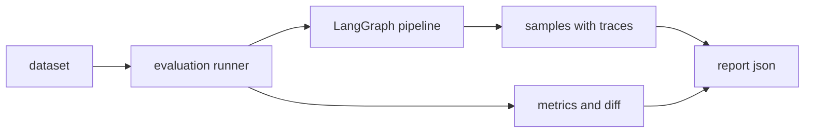

# EVALUATION

这份文档是评测唯一入口，解决四件事：
- 指标含义是什么，如何解释
- 对比实验怎么设计，如何定位提升来源
- 历史实验数据结论是什么，怎么在面试中说明
- 评测失败时怎么排障和阻断退化发布

## 评测目标

一次评测会输出两类结果：
- 样本级证据：`answer` `citations` `contexts` `status` `failure_reason` `decision_log` `tool_traces`
- 聚合级指标：`metrics` `retrieval_metrics` `gate_metrics` `reliability_metrics` `baseline.diff` `threshold_gate`



## 前置条件

必需环境变量：
- `OPENAI_API_KEY` 或 `LLM_API_KEY`
- `LLM_BASE_URL`
- `LLM_MODEL`

可选环境变量：
- `EMBEDDINGS_PROVIDER` 默认 `hf`
- `EMBEDDINGS_MODEL` 默认 `sentence-transformers/all-MiniLM-L6-v2`
- `MILVUS_HOST` `MILVUS_PORT` 本地中间件接入

## 常用命令

基础评测：

```bash
conda run -n LangChain python -m riskagent_agenticrag.evaluation.run --stage step4 --label step4
```

检索质量：

```bash
conda run -n LangChain python -m riskagent_agenticrag.evaluation.run --profile retrieval --retrieval-k 5,10,20 --label retrieval_v1
```

门禁收益：

```bash
conda run -n LangChain python -m riskagent_agenticrag.evaluation.run --profile gate --with-gate --label gate_v1
```

稳定性与成本：

```bash
conda run -n LangChain python -m riskagent_agenticrag.evaluation.run --profile reliability --include-latency --include-cost --label reliability_v1
```

基线对比：

```bash
conda run -n LangChain python -m riskagent_agenticrag.evaluation.run --profile all --compare-report .artifacts/reports/your_baseline.json --label all_v1
```

阈值门禁：

```bash
conda run -n LangChain python -m riskagent_agenticrag.evaluation.run --profile all --enforce-thresholds --thresholds docs/eval_thresholds.yaml --label gate_all_v1
```

## 参数速览

- `--stage` step1 step2 step3 step4
- `--profile` all retrieval gate reliability
- `--retrieval-k` 例如 1,3,5 或 5,10,20
- `--compare-report` 和 `--baseline-report` 基线报告路径
- `--enforce-thresholds` 开启门禁，fail 返回非零退出码
- `--enable-citation-judge` `--citation-judge-mode` 开启句级引用精度评测

judge 模式：
- auto 优先 llm，不可用时退到 heuristic
- llm 强制 llm
- heuristic 离线规则打分

## 指标含义

### retrieval

| 指标 | 含义 | 典型解释 |
| --- | --- | --- |
| retrieval_recall_at_K | K 内是否命中相关证据 | 越高说明召回覆盖越好 |
| retrieval_mrr | 首个相关结果排名倒数平均 | 越高说明相关文档更靠前 |
| retrieval_ndcg_at_K | 排序质量综合指标 | 越高说明排序更合理 |
| retrieval_dense_hit_rate | dense 召回可用率 | 稠密检索稳定性 |
| retrieval_sparse_hit_rate | sparse 召回可用率 | 关键词检索稳定性 |
| retrieval_hybrid_gain_rate | 混合检索收益率 | 融合策略有效性 |
| retrieval_rerank_uplift | 重排前后排名提升 | cross-encoder 价值 |

### gate

| 指标 | 含义 | 典型解释 |
| --- | --- | --- |
| gate_block_rate | 被门禁拦截比例 | 门禁触发强度 |
| gate_block_benefit_rate | 阻断了不可靠输出的比例 | 门禁收益 |
| gate_false_kill_rate | 误杀可用答案比例 | 越低越好 |
| failure_reason_distribution | 失败原因分布 | 退化定位入口 |

### reliability latency cost

| 指标 | 含义 | 典型解释 |
| --- | --- | --- |
| reliability_success_rate | 成功率 | 越高越好 |
| reliability_error_rate | 错误率 | 越低越好 |
| reliability_timeout_rate | 超时率 | 越低越好 |
| latency_p50_ms p95_ms p99_ms | 端到端时延分位 | 尾时延是上线重点 |
| node_latency_p95 | 节点级 p95 时延 | 定位瓶颈节点 |
| cost_estimated_total_tokens | 单请求 token 估算 | 成本基线 |
| cost_estimated_usd | 单请求美元成本估算 | 预算控制 |

### citation and domain

| 指标 | 含义 | 典型解释 |
| --- | --- | --- |
| citations_coverage | 回答是否带有效引用 | 证据覆盖 |
| citation_precision | 引用是否支持句子结论 | 证据精度 |
| hallucination_rate_in_citations | 带引用但不被支持比例 | 越低越好 |
| numeric_consistency_score | 数值一致性得分 | 数值可信度 |
| glossary_consistency_score | 术语一致性得分 | 术语规范性 |
| domain_consistency_score | 领域一致性总分 | 业务对齐程度 |

## 对比与提升实验方案

推荐三组实验：
- baseline：基础链路，作为对照组
- ablation：逐项关闭能力，定位边际收益
- final：全量能力 + 门禁，作为发布候选

建议 ablation 维度：
- 关闭 rerank，观察 `retrieval_mrr` `retrieval_ndcg_at_K`
- 关闭 hybrid 一路，观察 `retrieval_recall_at_K` 命中率
- 关闭高级索引，观察长文档相关问题的一致性
- 关闭 self-rag 与门禁，观察 `gate_false_kill_rate` 与错误率

统一复现实验命令：

```bash
python -m riskagent_agenticrag.evaluation.run --profile all --label baseline_all_v1
python -m riskagent_agenticrag.evaluation.run --profile retrieval --retrieval-k 5,10,20 --label retrieval_all_v1 --compare-report .artifacts/reports/<baseline>.json
python -m riskagent_agenticrag.evaluation.run --profile gate --with-gate --label gate_all_v1 --compare-report .artifacts/reports/<baseline>.json
python -m riskagent_agenticrag.evaluation.run --profile reliability --include-latency --include-cost --label reliability_all_v1 --compare-report .artifacts/reports/<baseline>.json
python -m riskagent_agenticrag.evaluation.run --profile all --enforce-thresholds --thresholds docs/eval_thresholds.yaml --label final_gate_v1 --compare-report .artifacts/reports/<baseline>.json
```

## 历史实验数据小结

以下数据来自仓库内可复现报告：
- baseline：`.artifacts/reports/rag_eval_step1_real_20260127_072539.json`
- final：`.artifacts/reports/rag_eval_step4_20260202_102949.json`
- 数据集：`tests/data/questions.json` 共 20 题

| 指标 | baseline | final | delta |
| --- | ---: | ---: | ---: |
| citations_coverage | 1.0000 | 1.0000 | +0.0000 |
| citation_precision | 0.3986 | 0.2071 | -0.1914 |
| numeric_consistency_score | 0.2468 | 0.5212 | +0.2744 |
| domain_consistency_score | 0.6234 | 0.7606 | +0.1372 |

结论口径：
- 领域一致性与数值一致性显著提升
- 引用覆盖保持稳定
- citation_precision 在这组跨阶段历史报告中下降，解释时需明确口径并建议同口径重跑

## 报告阅读与排障

先看：
- `metrics` 判断整体质量
- `baseline.diff` 判断是否退化
- `threshold_gate.verdict` 判断是否允许发布

再看：
- `samples.status` `samples.failure_reason` 定位失败样本
- `samples.node_latencies` 找性能瓶颈
- `debug.artifact_bundle_dir/trace.json` 追踪节点决策

## 新增评测样本

编辑 `tests/data/questions.json`：

```json
[
  {
    "id": "q1",
    "question": "What is FRTB",
    "reference_answer": "...",
    "ground_truth_contexts": ["..."]
  }
]
```

## 验收建议

- 功能回归: `python -m pytest tests/`
- 评测链路: 至少跑一次 `--profile all`
- 门禁链路: 跑一次 `--enforce-thresholds` 验证退出码
- trace 排障说明见 [DATA.md](./DATA.md) 的 Trace 章节

## 面试速答

### 指标速答卡

- 对比口径
  - baseline: `.artifacts/reports/rag_eval_step1_real_20260127_072539.json`
  - final: `.artifacts/reports/rag_eval_step4_20260202_102949.json`
  - 数据集: `tests/data/questions.json` 共 20 题
- 关键可背指标
  - `domain_consistency_score`: `0.6234 -> 0.7606` `(+0.1372)`
  - `numeric_consistency_score`: `0.2468 -> 0.5212` `(+0.2744)`
  - `citations_coverage`: `1.0000 -> 1.0000` `(持平)`
- 追问应答
  - 为什么 `citation_precision` 下降: 跨阶段历史报告对比, 口径与配置并非完全同构, 最终上线以同口径重跑结果为准
  - 如何阻断退化发布: 使用 `--enforce-thresholds` 和 `docs/eval_thresholds.yaml`, 门禁失败返回非零退出码

### 高频题速答

- Q1 多智能体方案的价值是什么
  A: 把检索 生成 评审拆成独立职责, 便于定位退化来源并做节点级治理
- Q2 为什么强调引用是 contract
  A: 回答必须可回溯到语料证据, 否则无法用于工程排障与风险解释
- Q3 如何定义有效引用
  A: 引用必须能映射到真实 source 与片段位置, 并支撑当前句结论
- Q4 如何判断检索优化是否真实有效
  A: 先看 retrieval_recall_at_K retrieval_mrr retrieval_ndcg_at_K, 再看样本级失败分布是否收敛
- Q5 门禁指标最核心看什么
  A: 主要看 gate_block_benefit_rate 和 gate_false_kill_rate, 目标是高收益低误杀
- Q6 为什么需要阈值门禁
  A: 把评测结果转成可执行发布规则, 避免主观判断带来质量回退
- Q7 如何解释性能与成本
  A: 用 latency_p95_ms latency_p99_ms 说明尾时延, 用 cost_estimated_total_tokens 与 cost_estimated_usd 说明成本
- Q8 如何保证实验可复现
  A: 固定数据集 固定评测命令 保留 baseline 报告并输出对比 diff
- Q9 为什么要有 trace
  A: trace 能定位失败节点 上下游输入输出和时延瓶颈, 是排障主入口
- Q10 线上问题优先排查顺序
  A: 先看 threshold_gate 与 baseline.diff, 再看 samples.failure_reason, 最后下钻 trace
- Q11 如何避免"看起来提升但不可上线"
  A: 必须同口径对比并通过阈值门禁, 单次离线提升不等于可发布
- Q12 项目对业务方最直接的价值
  A: 提供可验证 可解释 可回归的风险问答, 不只给结论, 还给证据与退化边界

### 面试建议

- 讲结果时固定四步: 口径 -> 指标 -> 机制 -> 风险边界
- 讲优化时固定三步: baseline 问题 -> 改动策略 -> 指标变化
- 讲风险时主动补充: 哪些指标仍需同口径重跑确认
