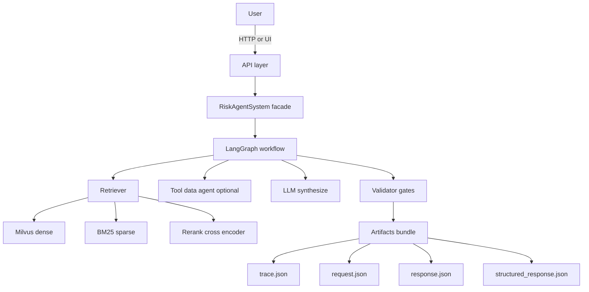

# OVERVIEW

这份文档用一页把项目讲清楚
适合第一次读代码时快速建立整体心智模型

## 这个项目解决什么问题

你把金融风控和衍生品资料放进 corpus
你把问题丢进来
系统会用工程师更容易读的方式解释
同时输出 citations 你可以回到原文核对

目标不是多答
目标是可信 可回放 可定位问题

## 一次请求发生了什么



关键点
1 只有一个主路径 LangGraph
2 每次请求都会落盘 artifacts bundle 便于回放和排障
3 trace 里保留 top8 检索原文片段和引用信息

## 常用入口

- 命令入口统一看 [QUICKSTART.md](./QUICKSTART.md)
- 评测入口统一看 [EVALUATION.md](./EVALUATION.md)
- trace 排障统一看 [TRACE.md](./TRACE.md)

## artifacts bundle 目录结构

每次请求会生成一个目录
目录名形如 timestamp_request_id

```text
.artifacts/
  20260214_120102_aaaaaaaa-bbbb-cccc-dddd-eeeeeeeeeeee/
    request.json
    response.json
    structured_response.json
    trace.json
```

## 下一步你可以从哪里开始读

- ARCHITECTURE 了解模块拆分和数据流
- DATA 了解 citations evidence_set claims trace 的字段含义
- API 了解接口 contract 和鉴权
- TRACE 了解 trace.json 如何用来定位问题
