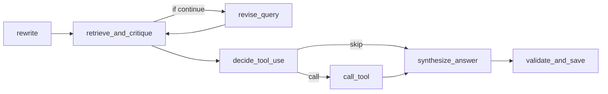

# TRACE

trace 是每次请求的执行记录
它会和 request response 放在同一个 artifacts bundle 目录里
你可以用它回答两个问题
1 这次回答为什么是这样
2 如果失败了 是哪个节点失败 失败原因是什么

## trace 在哪里

每次请求的 response.debug 里会返回 artifact_bundle_dir
你在这个目录里能找到 trace.json

```text
.artifacts/<timestamp>_<request_id>/trace.json
```

你也可以通过环境变量改路径
- RISKAGENT_ARTIFACTS_DIR

## trace 里有什么

trace.json 顶层字段
- request_id
- run_id
- model_id
- prompt_version
- retriever_version
- nodes
- final

nodes 是数组
每一项对应 LangGraph 的一个节点
每个节点都有
- name
- start_ms end_ms latency_ms
- payload 输入摘要
- result 输出摘要

## 节点列表



## 检索结果 top8

在 retrieve_and_critique 的 result.docs 里
每条 doc 都包含引用信息和原文片段
- chunk_id source section_path
- page start_line end_line start_index
- parent_id
- rrf_score coarse_score rerank_score
- snippet

snippet 默认 240 字
可以用环境变量调节
- RISKAGENT_TRACE_SNIPPET_CHARS

## 如何用 trace 定位问题

1 先看 trace.final
这里有 status 和 failure_reason

2 再看 validate_and_save
它会写出 claims evidence_set
并执行 gates
失败通常能在这个节点直接看到原因

3 如果是证据不足
看 retrieve_and_critique
看 docs_count 和 top8 docs 的 snippet

