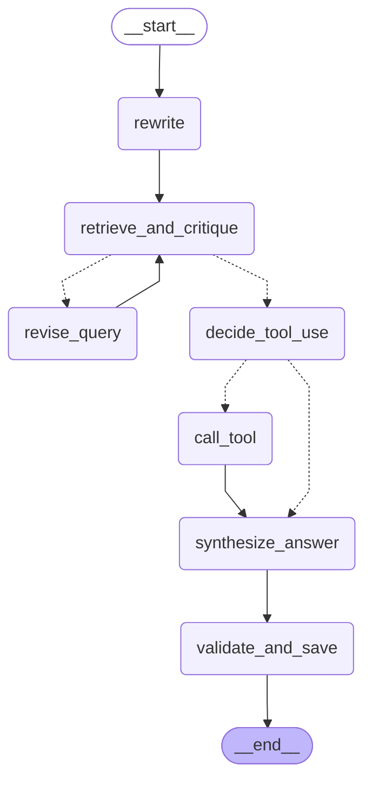

# LangGraph Agentic Loop 可视化

这是 RiskAgent 项目中 agentic RAG loop 的执行流程图.

## 流程图

## 说明

- **查询改写 (rewrite)**: 将用户问题改写为更适合检索的 query
- **检索与评估 (retrieve_and_critique)**: 检索文档并评估质量
- **修订查询 (revise_query)**: 基于 critique 改进 query
- **决策工具调用 (decide_tool_use)**: LLM 决定是否需要调用工具
- **调用工具 (call_tool)**: 调用 DataAgent 获取结构化数据
- **合成答案 (synthesize_answer)**: 基于检索结果和工具输出生成最终答案
- **验证与落盘 (validate_and_save)**: 运行 validator gates 并保存 artifacts

## 查看方式

1. 在 GitHub 上直接查看 (GitHub 原生支持 Mermaid)
2. 使用 Mermaid 在线编辑器: https://mermaid.live/
3. 在支持 Mermaid 的 Markdown 编辑器中查看 (如 Typora, VS Code with Mermaid extension)
